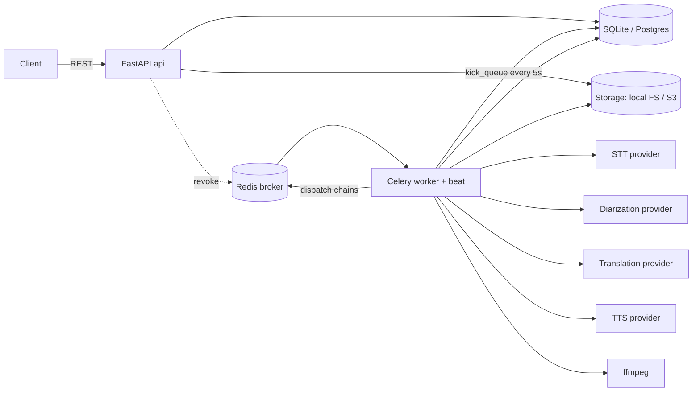
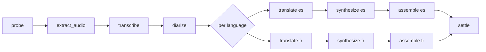
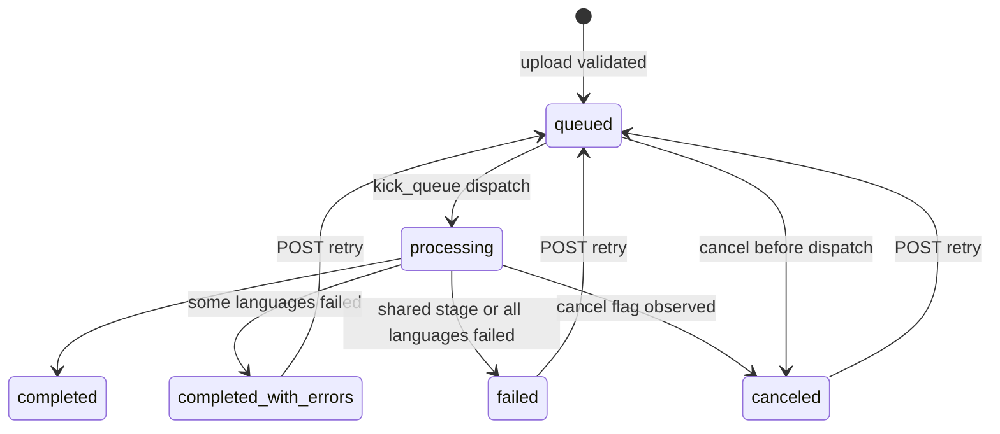

# Architecture

## High-level components



- **api** is stateless: it validates uploads, writes job rows + files, and reads state.
  It never processes media. Scale horizontally behind a load balancer.
- **worker** runs the pipeline. All coordination goes through the DB and storage —
  Celery task payloads carry only `(job_id, lang)`, never data. Any worker can pick up
  any task; workers are stateless and horizontally scalable.
- **redis** is the default broker (SQS and RabbitMQ are config swaps). No result
  backend is used — **the DB is the source of truth** for job state, and
  `task_ignore_result` makes that explicit.
- **storage** is an abstraction (local filesystem by default, S3/MinIO selectable);
  multi-node deployments use S3 so api and workers share artifacts.

## Processing pipeline



| Stage | What it does | Checkpoint artifact |
|---|---|---|
| probe | deep ffprobe validation (decodable, has audio+video, duration ≤ limit) | `stages/probe.json` |
| extract_audio | 16kHz mono WAV via ffmpeg | `audio/source_16k.wav` |
| transcribe | STT with word timestamps + language auto-detection; segment rows | `stages/transcript.json` |
| diarize | speaker embeddings per segment → clustering → speaker rows, gender heuristic, per-language voice assignment | `stages/diarization.json` |
| translate (×lang) | batch translation preserving order/speaker mapping | `stages/translation_{lang}.json` |
| synthesize (×lang) | per-segment TTS with the speaker's assigned voice | `tts/{lang}/raw_*.mp3`, `stages/synth_{lang}.json` |
| assemble (×lang) | timing fit (see below), timeline overlay, duck+mux, SRT files | `out/dubbed_{lang}.mp4`, `out/subs_*.srt` |

`settle` closes the job once every language branch is terminal. It is a Celery task
rather than a pipeline stage — it has no checkpoint and no artifacts, it just reads the
branch outcomes and writes the final status.

### Job state machine



Per-stage statuses live in `job_stages` (pending/running/completed/failed/canceled,
attempts, timings, error, artifacts). Progress % is a weighted sum of completed stages.

## Audio-video synchronization

For each segment with original slot `s` and synthesized duration `d`:
1. `d ≤ s` → place at the original start; trailing silence (never slow speech down).
2. `d > s` → spill into the silence gap before the next segment (minus a 0.1s guard).
3. Still too long → speed up with ffmpeg `atempo` up to `max_tempo` (default 1.5×).
4. Beyond the clamp → accept a brief overlap into the next segment and record
   `overflow_sec` (cutting words is worse than 300ms of overlap).

Fitted clips are summed onto a 24kHz timeline buffer, mixed over the original audio
ducked to `duck_volume` (keeps music/ambience), and muxed with `-c:v copy` (video is
never re-encoded). Translated SRT uses the *fitted* placements so subtitles match the
dubbed audio; the original-language SRT uses the original timings.

## AI model selection strategy

Every AI capability owns a folder. The folder's `__init__.py` defines the **interface**
for that capability and the data types it speaks in; every implementation is a separate
file beside it. `app/providers/__init__.py` holds no interfaces and no providers — only
the registry, the fallback chain and the retry helper:

```
app/providers/
  __init__.py       registry: register / available / get_provider, Fallback, with_retries
  stt/
    __init__.py     STT interface + Transcript, Segment, Word
    faster_whisper.py  openai_whisper.py  deepgram.py  assemblyai.py  google_stt.py
  diarization/
    __init__.py     Diarizer interface + Diarization + the shared pitch heuristic
    ecapa_cluster.py
  translation/
    __init__.py     Translator interface + the shared LLM base (prompt, JSON parsing)
    argos.py  claude.py  openai.py  gemini.py  deepl.py
  tts/
    __init__.py     TTS interface + Voice + the voice catalog and speaker casting
    edge.py  azure.py  elevenlabs.py  xtts.py  openvoice.py
  storage/
    __init__.py     Storage interface
    local.py  s3.py
```

A provider therefore imports its contract from its own package and the machinery from
the registry — `from app.providers.stt import STT, Transcript` plus
`from app.providers import register, require_credential`. The dependency runs one way
(capability → registry), so no capability can drag another one in.

**The file name is the configured name.** `providers.stt.name = deepgram` resolves to
`app/providers/stt/deepgram.py`, imported the first time it is selected. Two things
follow from that: adding a vendor is *one new file* — no registration list to edit, no
existing file to touch — and an unused provider never costs its dependencies, so
selecting Deepgram does not import torch and selecting local storage does not import
boto3. A test walks every provider file, imports it, and asserts it registers under its
own file name, so a typo cannot leave a provider quietly unreachable.

```yaml
providers:
  stt: {name: faster_whisper, options: {model: small, compute_type: int8}}
```

Switching to Deepgram or ElevenLabs is a config/env change (`PROVIDERS__STT__NAME=deepgram`)
— zero code changes. Providers requiring credentials fail fast at instantiation with a
clear message. Optional fallback chains (`providers.<kind>.fallbacks: [...]`) delegate
to the next provider when one fails. Network providers wrap calls in retry-with-backoff;
whole stages run under Celery soft time limits.

## Queue architecture & concurrency

- One Celery queue. **The broker is configuration, not code**: Redis by default,
  AWS SQS via `docker-compose.sqs.yml` (ElasticMQ locally, real SQS by dropping the
  service and the endpoint host), RabbitMQ by pointing `broker_url` at `amqp://`.
  Job state lives in Postgres, so no result backend is required — `result_backend`
  is empty on the SQS profile. Verified: the full 22-check E2E passes on SQS,
  including cancellation, which matters because SQS has no Celery remote-control
  revoke — cancel is a DB flag by design, so it works on brokers without it.
  On SQS, `visibility_timeout` must exceed the longest stage or the message is
  redelivered mid-processing and the stage runs twice.
- Workers prefork with configurable `--concurrency`.
- **Admission control**: a beat task (`kick_queue`, 5s) dispatches queued jobs only
  while `processing < limits.max_concurrent_jobs`; upload returns 429 when
  `queued+processing ≥ limits.max_queue_length`. Upload concurrency itself is gated.
- Per-language branches run as independent Celery chains — a 3-language job uses up
  to 3 workers in parallel after diarization.
- Tasks are acked late (`task_acks_late`) so a worker crash requeues the running task;
  stage idempotency (checkpoint-skip) makes redelivery safe.

## Fault tolerance & recovery

| Failure | Handling |
|---|---|
| Transient (network/timeout to a provider) | task-level retry with exponential backoff (`task_max_retries`, `retry_backoff_sec`) |
| Model hang / stage overrun | Celery `soft_time_limit` per stage (config) → stage failed with timeout error |
| Corrupted upload | rejected at upload (quick probe) and again at pipeline probe stage |
| Per-language failure | branch marked failed; other languages continue; job → `completed_with_errors` |
| Shared-stage failure | job → `failed`, error surfaced in status + audit log |
| Worker crash mid-stage | acks-late redelivery; completed stages skip via checkpoints; a beat sweep reaps stages stuck `running` past their timeout so the job can't sit in `processing` forever |
| User retry | `POST /retry` resets only non-completed stages and re-dispatches; resume is free |
| Cancel | DB flag (polled at boundaries and inside loops) + best-effort revoke; a beat sweep settles jobs whose tasks were revoked before starting |

## Storage design

```
data/
  jobs/{job_id}/source.mp4              uploaded video
  jobs/{job_id}/audio/source_16k.wav    intermediate audio
  jobs/{job_id}/stages/*.json           stage checkpoints
  jobs/{job_id}/tts/{lang}/*.wav|mp3    per-segment synth clips + dub track
  jobs/{job_id}/out/dubbed_{lang}.mp4   final videos
  jobs/{job_id}/out/subs_{lang}.srt     subtitles (targets + source)
  models/                               model caches (compose volume)
```

Keys are server-generated (no user-controlled paths). The `StorageProvider` interface
makes the backend configurable; `LocalStorage` writes in place, `S3Storage` uploads and
maintains a local materialization cache for ffmpeg/model access.

## Database design

`jobs` (status, probe metadata, languages, cancel flag, retry count) →
`job_stages` (per stage × language: status/attempts/timings/artifacts/task id) →
`speakers` (label, gender, persisted per-language voice map) →
`segments` (timestamped transcript, speaker FK, word timings) →
`translations` (per segment × language) + `audit_logs` (every event, request ids).
SQLite for zero-setup dev, Postgres in compose — same SQLAlchemy models.

## Scaling strategy

Current single-box defaults process ~2 concurrent 10-minute videos comfortably on CPU.

- **5 concurrent videos**: one API replica + 2-3 workers (`--concurrency=4`),
  raise `limits.max_concurrent_jobs`. Docker Compose `--scale worker=3` suffices.
- **500 videos**: move storage to S3/MinIO (`providers.storage.name=s3`), Postgres
  managed, run workers as a Kubernetes Deployment with HPA on queue depth
  (e.g. KEDA Redis scaler: queue length > N → add workers). API scales on CPU/RPS.
  Everything is already stateless; no code changes.
- **5,000 videos**: split the queue per stage class (CPU-heavy transcribe/synthesize vs
  ffmpeg-bound assemble) so worker pools scale independently; GPU node pool for STT
  (`providers.stt.options.device` already passes through to faster-whisper, but the
  shipped image installs CPU-only torch — a GPU image is a Dockerfile change, not a
  code change); S3 lifecycle rules for
  intermediates; DB read replicas for status polling; rate-limit at the gateway.
  The beat dispatcher becomes a single lightweight deployment (it only flips DB rows).

Observability: structured JSON logs with request/job/stage context, audit trail in DB,
and Prometheus on two endpoints — the API serves `/metrics` (auth-protected) for upload
counters, and each worker serves `:9100/metrics` for the metrics that describe
processing (stage-duration histograms, job outcomes, active jobs). Celery prefork means
children write to `PROMETHEUS_MULTIPROC_DIR` and the worker's main process serves the
aggregate. A request's `X-Request-ID` is stored on the job and re-bound in every worker
stage, so HTTP requests and worker-side events correlate; OpenTelemetry spans would
attach at the same middleware/task-decorator seams.

## Multi-region deployment strategy

Not implemented — single-region is the right call at this size. The design does not
block it, and the shape it would take is below.

Media is the constraint: a 10-minute upload is hundreds of MB, and every stage reads
and writes artifacts. Moving a job between regions means moving its bytes, so **jobs
are pinned to the region that accepted the upload** and the stack replicates per
region: API + workers + queue + Postgres + a regional bucket. Nothing in the pipeline
holds cross-region state — stages already communicate only through the DB row and the
storage keys.

- **Routing**: latency-based DNS to the nearest region. `job_id` is a UUID, so ids stay
  unique without coordination; a status poll that lands in the wrong region is either
  routed by a `region` prefix on the id or served from a global read replica.
- **Data residency**: the same pinning gives EU-uploads-stay-in-EU for free, which is
  the usual reason media platforms go multi-region before they need the latency.
- **Failover**: the job row is the source of truth and every stage is resumable, so a
  region loss is recoverable rather than instant — replicate the bucket (S3 CRR) and
  the DB (logical replication or a global database), and jobs re-dispatch in the
  surviving region and resume from their last completed stage. Uploads fail over
  immediately; in-flight jobs resume at RPO/replication lag.
- **What stays global**: the container registry, the model cache (region-local mirrors
  of the same immutable artifacts), and metrics/log aggregation.
- **Cost caveat**: cross-region replication of large media is the dominant bill. In
  practice you replicate the DB and the *outputs*, not the intermediates — those are
  cheap to regenerate from the source, which is exactly what stage resume already does.

## Design trade-offs

See [DESIGN_DECISIONS.md](DESIGN_DECISIONS.md) for the full list with rationale.
